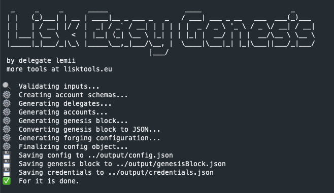

# Lisk Easy Genesis

Lisk Easy Genesis (L.E.G.) is a simple tool that allows you to create a Lisk SDK v5.x.x genesis block and application config in seconds. Use the interactive wizard or add your own base config.



### Table of Contents

- [Installation](#installation)
- [Usage](#usage)
  - [Option 1: Interactive Wizard](#option-1-interactive-wizard)
  - [Option 2: Using the Config File](#option-2-using-the-config-file)
  - [Account Schemas](#account-schemas)
- [Credits](#credits)
- [License](#license)

## Installation

```sh
git clone https://github.com/Lemii/lisk-easy-genesis
cd lisk-easy-genesis
npm i
```

## Usage

There are two ways of running the tool:

### Option 1: Interactive Wizard

If you have little experience, your sidechain is very basic, or if you simply want to fire up a network real quick, this is the option for you.

1. Run the tool with `npm run wizard`
2. Go through all the prompts
3. Done! ✔️

The output JSON files can be found in the `output` folder

Defaults are provided for technical matters, meaning that you can leave certain prompts empty if you don't know what to answer with.

The remainder of the settings are taken from the `baseConfig.json` found in the `input` folder.

### Option 2: Using the Config File

If you have more experience and know what you are doing, you can go ahead and edit the `baseConfig.js` file directly. This allows you to customize the genesis block and configuration in a more in depth manner. It will skip the prompts altogether.

1. Edit the `baseConfig.js` file to your liking, or replace it with your own (excluding the `forging.delegates` field)
2. Run the tool with `npm start`
3. Done! ✔️

The output JSON files can be found in the `output` folder

### Account Schemas

If your sidechain contains custom modules that modify the properties of an `account`, these must be included in the genesis block.

To do this, simply add the account schema for each module to the `schemas.js` file in the `input` folder. The variable name of the schema must match the module name. Don't forgot to `export` it!

Example:

```js
export const myCustomModule = {
  type: "object",
  properties: {
    myCustomField: {
      fieldNumber: 1,
      type: "array",
      items: {
        dataType: "string",
      },
    },
  },
  default: {
    myCustomField: [],
  },
};
```

The tool will then include all exported schemas in the genesis block.

## Credits

Parts of this tool are based on the excellent [Generating a genesis block](https://lisk.io/documentation/lisk-sdk/guides/app-development/genesis-block.html) guide written by [Mona Bärenfänger](https://github.com/Tschakki).

## License

[MIT](LICENSE)
